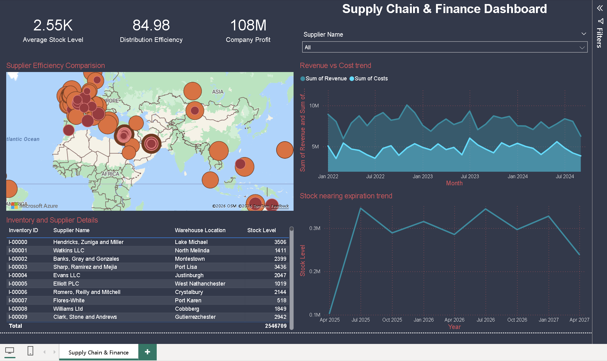
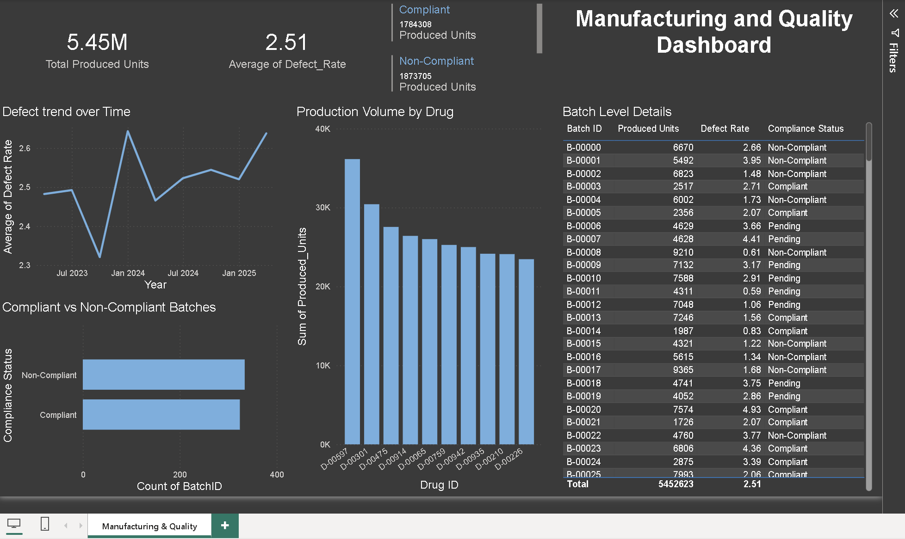
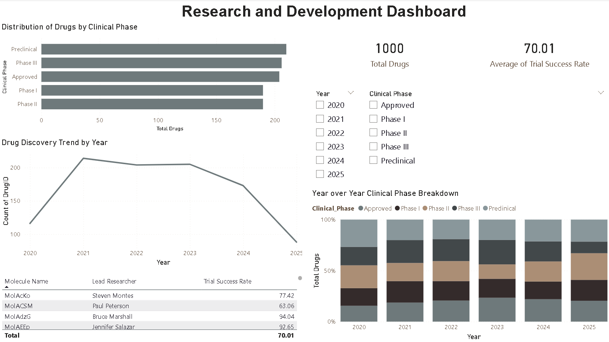

# Data Analytics Portfolio

Portfolio of Power BI reports and dashboards covering HR, finance, customer analytics, supply chain, manufacturing, and research analytics.

## Featured Reports

### 1. Budget & Expenditure Analytics Report
Multi-page financial analytics report covering budget monitoring, expenditure trends, department and cost-center analysis, drill-through reporting, tooltips, and mobile-optimized layouts.

📂 View project: [Budget & Expenditure Analytics](reports/budget-expenditure-analytics/project-notes.md)

### 2. Customer Churn Analysis Report
Interactive multi-page Power BI report analyzing customer churn, demographics, contract types, tenure, service usage, and key churn drivers.

📂 View project: [Customer Churn Analysis](reports/customer-churn-analysis/project-notes.md)

### 3. Employee Attrition Analytics Report
Interactive multi-page Power BI report analyzing workforce attrition, demographics, tenure, overtime, and business travel patterns.

📂 View project: [Employee Attrition Analytics](reports/employee-attrition-analytics/project-notes.md)

---

## Dashboards

### Supply Chain & Finance Dashboard
Operational dashboard monitoring supplier efficiency, inventory levels, revenue and cost trends, stock expiry, and supplier locations.

### Manufacturing & Quality Dashboard
Manufacturing analytics dashboard tracking production volume, defect rates, compliance status, and batch-level quality performance.

### Research & Development Dashboard
R&D dashboard analyzing clinical phases, drug discovery trends, trial success rates, and year-over-year pipeline distribution.

