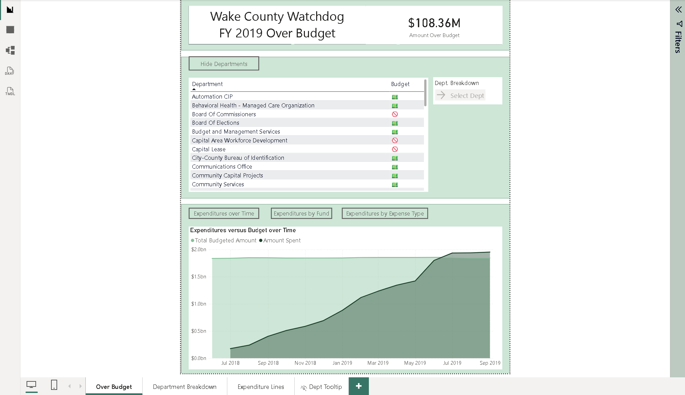
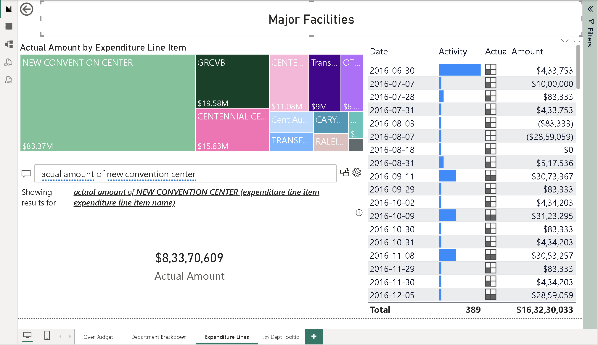
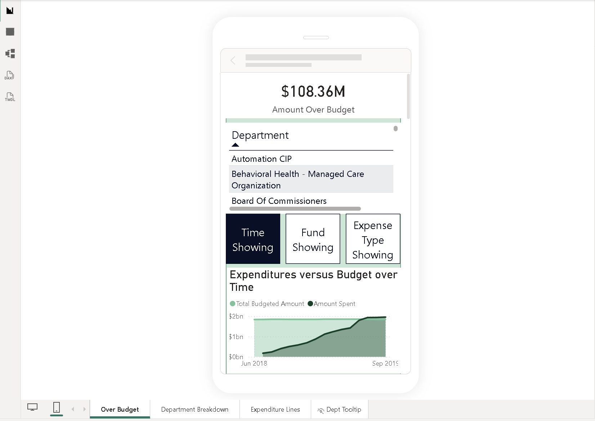

# Budget & Expenditure Analytics Report

## Objective

Analyze budget and expenditure data across departments, funds, cost centers, and expenditure categories to monitor spending patterns, identify over-budget areas, and support detailed financial analysis.

## Tools Used

- Power BI
- DAX
- Power Query

## Key Areas Covered

- Budget versus actual expenditure analysis
- Department-level spending
- Fund-level expenditure analysis
- Expenditure by expense type
- Cost center analysis
- Expenditure trends over time
- Detailed expenditure line items
- Department drill-through analysis

## Project Type

Multi-page financial analytics report

## Key Features

- Desktop and mobile-optimized report layouts
- Mobile navigation using report buttons
- Drill-through department analysis
- Report page tooltips
- Budget versus expenditure monitoring
- Department and cost-center analysis
- Detailed expenditure-line analysis
- Interactive filtering and navigation

## Insights

- FY2019 spending exceeded the available budget by **$108.36M**.
- Expenditure increased substantially over time and eventually moved beyond the overall budget level.
- Department-level analysis allows individual spending patterns and cost centers to be examined in greater detail.
- Expenditure can be analyzed across different funds and expense types to identify where spending is concentrated.
- Detailed transaction-level views provide additional context behind department and expenditure totals.

## Report Preview

### Budget Overview

### Expenditure Lines

### Mobile Layout

