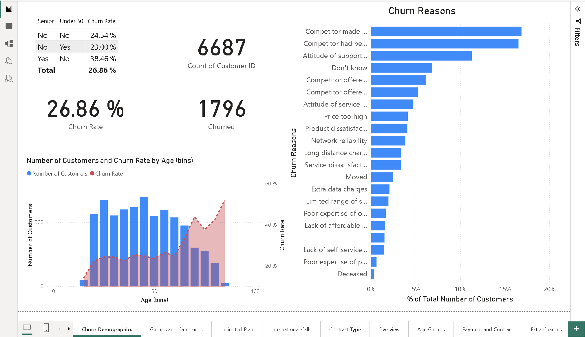
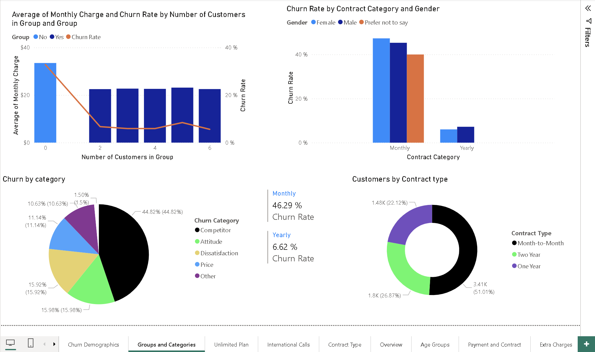

# Customer Churn Analysis Report

## Objective

Analyze customer churn patterns across demographics, contract types, service usage, payment methods, account tenure, and churn reasons to identify high-risk customer segments and key drivers of customer attrition.

## Tools Used

- Power BI
- DAX
- Power Query

## Key Areas Covered

- Overall customer churn rate
- Customer demographic analysis
- Contract type and churn relationship
- Churn reasons and categories
- Account tenure analysis
- Unlimited data plan usage
- Payment method analysis
- Customer service interactions
- Geographic churn patterns
- Customer grouping and segmentation

## Project Type

Multi-page analytical report

## Key Features

- Interactive filtering
- Multi-page navigation
- KPI and churn-rate analysis
- Customer segmentation
- Contract and demographic analysis
- Geographic churn visualization
- Trend and comparative analysis
- DAX-based measures and calculated KPIs

## Insights

- Overall churn rate was **26.86%**, with **1,796 churned customers out of 6,687 customers**.
- Monthly-contract customers recorded a **46.29% churn rate**, compared with **6.62% for yearly contracts**.
- Senior customers recorded a churn rate of **38.46%**, higher than the overall customer base.
- Competitor-related reasons represented the largest category of customer churn.
- Churn generally decreased as account length increased, indicating higher churn risk among newer customers.
- Contract structure, customer demographics, service usage, and customer experience showed meaningful relationships with churn.

## Report Preview

### Overview

.png)

### Churn Demographics

### Groups and Categories

