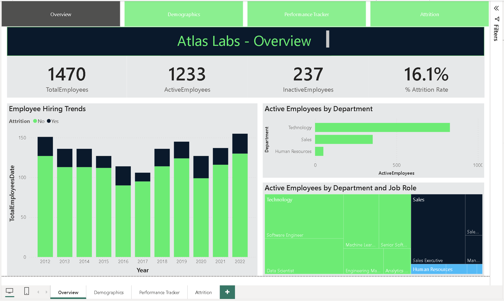
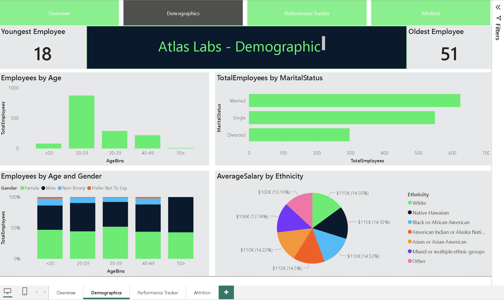
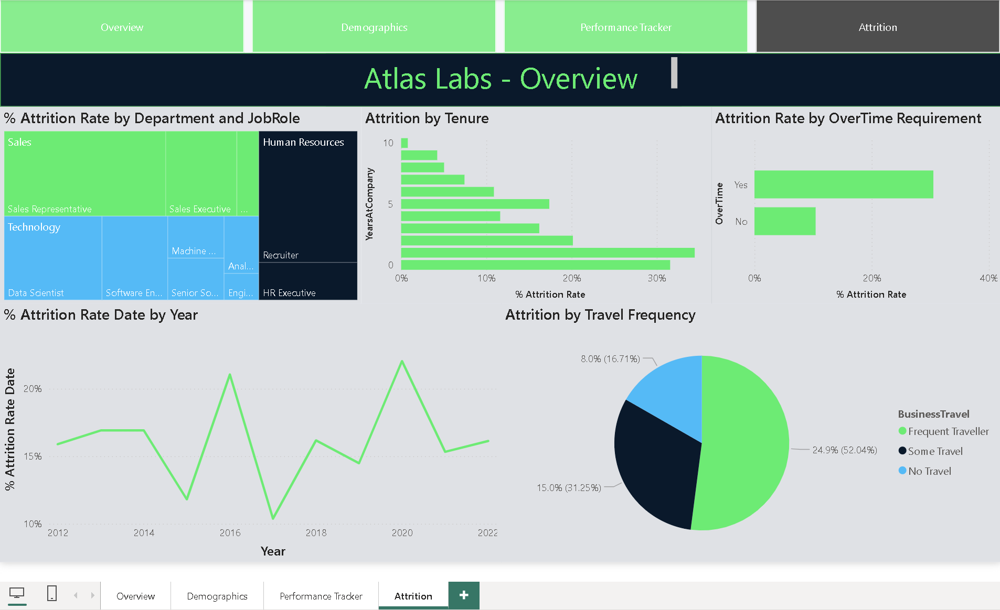

# Employee Attrition Analytics Report

## Objective
Analyze employee attrition patterns using workforce demographics, hiring trends, tenure, travel frequency, overtime requirements, and department-level job role data.

## Tools Used
- Power BI
- DAX
- Power Query

## Key Areas Covered
- Attrition rate monitoring
- Active vs inactive employee analysis
- Hiring trend analysis (2012–2022)
- Employee demographics (age, marital status, gender distribution)
- Department and job role attrition analysis
- Tenure and business travel impact on attrition
- Overtime vs attrition relationship

## Project Type
Multi-page analytical report

## Key Features
- Interactive filtering
- Multi-page navigation
- Department and job role drill-down
- Trend analysis across time
- Cross-dimensional workforce analysis

## Insights
- Attrition varies significantly by department and job role.
- Overtime requirements appear associated with higher attrition.
- Travel frequency shows potential impact on employee turnover.
- Attrition patterns differ across tenure groups.
- Workforce demographics provide additional segmentation context.

## Report Preview

### Overview

### Demographics

### Attrition Analysis

